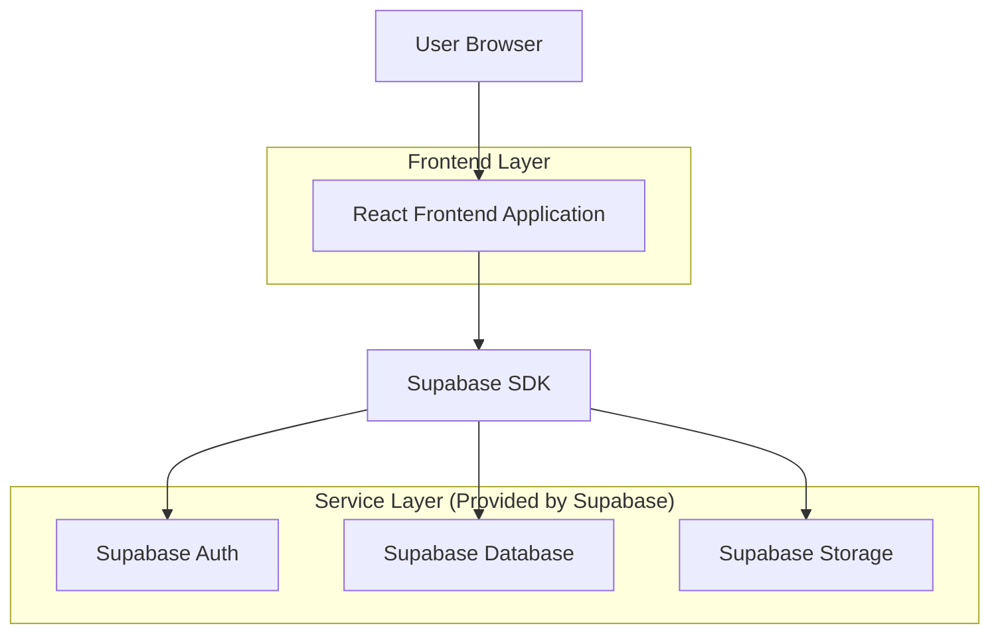
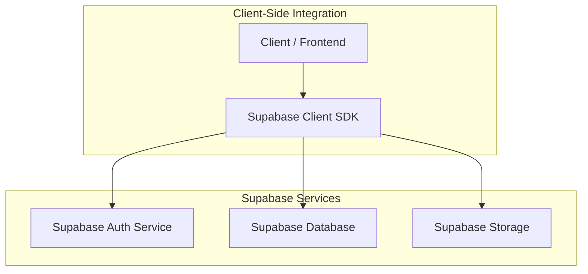
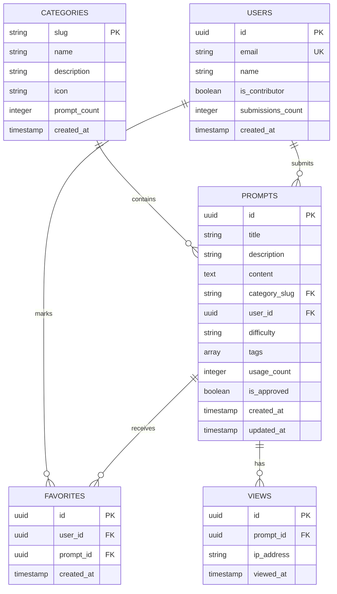

## 1. Architecture design



## 2. Technology Description

- Frontend: React@18 + tailwindcss@3 + vite
- Initialization Tool: vite-init
- Backend: Supabase (PostgreSQL)
- Additional Libraries: 
  - @supabase/supabase-js@2 (client SDK)
  - react-router-dom@6 (routing)
  - lucide-react (icons)
  - react-hot-toast (notifications)

## 3. Route definitions

| Route | Purpose |
|-------|---------|
| / | Home page, displays hero section and featured prompts |
| /category/:slug | Category page, lists prompts by category |
| /prompt/:id | Prompt detail page, shows full prompt content |
| /search | Search page, displays search results |
| /submit | Submit prompt page, form for new prompt submission |
| /login | Login page, user authentication |
| /register | Registration page, new user signup |
| /profile | User profile page, shows user contributions |

## 4. API definitions

### 4.1 Prompt Management APIs

```
GET /api/prompts
```

Request:
| Param Name | Param Type | isRequired | Description |
|------------|-------------|-------------|-------------|
| category | string | false | Filter by category slug |
| search | string | false | Search term |
| limit | number | false | Number of results (default: 20) |
| offset | number | false | Pagination offset |

Response:
| Param Name | Param Type | Description |
|------------|-------------|-------------|
| prompts | array | Array of prompt objects |
| total | number | Total count of prompts |

```json
{
  "prompts": [
    {
      "id": "uuid",
      "title": "Landing Page Hero",
      "description": "Create a hero section for SaaS landing page",
      "content": "Create a modern hero section with...",
      "category": "landing-pages",
      "tags": ["saas", "hero", "conversion"],
      "difficulty": "beginner",
      "usage_count": 152
    }
  ],
  "total": 1
}
```

```
POST /api/prompts/submit
```

Request:
| Param Name | Param Type | isRequired | Description |
|------------|-------------|-------------|-------------|
| title | string | true | Prompt title |
| description | string | true | Brief description |
| content | string | true | Full prompt content |
| category | string | true | Category slug |
| tags | array | false | Array of tag strings |
| difficulty | string | true | beginner/intermediate/advanced |

### 4.2 Category APIs

```
GET /api/categories
```

Response:
```json
{
  "categories": [
    {
      "slug": "landing-pages",
      "name": "Landing Pages",
      "description": "Prompts for creating landing pages",
      "prompt_count": 45,
      "icon": "layout"
    }
  ]
}
```

### 4.3 User Management APIs

```
POST /api/auth/register
```

Request:
| Param Name | Param Type | isRequired | Description |
|------------|-------------|-------------|-------------|
| email | string | true | User email address |
| password | string | true | User password |
| name | string | true | Display name |

## 5. Server architecture diagram



## 6. Data model

### 6.1 Data model definition



### 6.2 Data Definition Language

Categories Table (categories)
```sql
-- create table
CREATE TABLE categories (
    slug VARCHAR(50) PRIMARY KEY,
    name VARCHAR(100) NOT NULL,
    description TEXT,
    icon VARCHAR(50) NOT NULL,
    prompt_count INTEGER DEFAULT 0,
    created_at TIMESTAMP WITH TIME ZONE DEFAULT NOW()
);

-- insert initial categories
INSERT INTO categories (slug, name, description, icon) VALUES
('landing-pages', 'Landing Pages', 'Prompts for creating landing pages and homepages', 'layout'),
('dashboards', 'Dashboards', 'Admin panels and analytics dashboards', 'dashboard'),
('forms', 'Forms', 'Contact forms, surveys and input components', 'form-input'),
('ecommerce', 'E-commerce', 'Online stores and product pages', 'shopping-cart'),
('authentication', 'Authentication', 'Login, signup and user management', 'user'),
('components', 'Components', 'Reusable UI components and elements', 'puzzle'),
('animations', 'Animations', 'Interactive and animated elements', 'sparkles'),
('mobile-app', 'Mobile App', 'Mobile-first applications', 'smartphone');
```

Prompts Table (prompts)
```sql
-- create table
CREATE TABLE prompts (
    id UUID PRIMARY KEY DEFAULT gen_random_uuid(),
    title VARCHAR(200) NOT NULL,
    description TEXT NOT NULL,
    content TEXT NOT NULL,
    category_slug VARCHAR(50) REFERENCES categories(slug),
    user_id UUID REFERENCES auth.users(id),
    difficulty VARCHAR(20) CHECK (difficulty IN ('beginner', 'intermediate', 'advanced')),
    tags TEXT[],
    usage_count INTEGER DEFAULT 0,
    is_approved BOOLEAN DEFAULT false,
    created_at TIMESTAMP WITH TIME ZONE DEFAULT NOW(),
    updated_at TIMESTAMP WITH TIME ZONE DEFAULT NOW()
);

-- create indexes
CREATE INDEX idx_prompts_category ON prompts(category_slug);
CREATE INDEX idx_prompts_difficulty ON prompts(difficulty);
CREATE INDEX idx_prompts_approved ON prompts(is_approved);
CREATE INDEX idx_prompts_created ON prompts(created_at DESC);
CREATE INDEX idx_prompts_usage ON prompts(usage_count DESC);

-- grant permissions
GRANT SELECT ON prompts TO anon;
GRANT ALL ON prompts TO authenticated;
```

Favorites Table (favorites)
```sql
-- create table
CREATE TABLE favorites (
    id UUID PRIMARY KEY DEFAULT gen_random_uuid(),
    user_id UUID REFERENCES auth.users(id) ON DELETE CASCADE,
    prompt_id UUID REFERENCES prompts(id) ON DELETE CASCADE,
    created_at TIMESTAMP WITH TIME ZONE DEFAULT NOW(),
    UNIQUE(user_id, prompt_id)
);

-- create indexes
CREATE INDEX idx_favorites_user ON favorites(user_id);
CREATE INDEX idx_favorites_prompt ON favorites(prompt_id);

-- grant permissions
GRANT SELECT ON favorites TO anon;
GRANT ALL ON favorites TO authenticated;
```

Views Table (views)
```sql
-- create table
CREATE TABLE views (
    id UUID PRIMARY KEY DEFAULT gen_random_uuid(),
    prompt_id UUID REFERENCES prompts(id) ON DELETE CASCADE,
    ip_address INET,
    viewed_at TIMESTAMP WITH TIME ZONE DEFAULT NOW()
);

-- create indexes
CREATE INDEX idx_views_prompt ON views(prompt_id);
CREATE INDEX idx_views_date ON views(viewed_at);

-- grant permissions
GRANT SELECT ON views TO anon;
GRANT ALL ON views TO authenticated;
```

### 6.3 Row Level Security (RLS) Policies

```sql
-- Enable RLS
ALTER TABLE prompts ENABLE ROW LEVEL SECURITY;
ALTER TABLE favorites ENABLE ROW LEVEL SECURITY;
ALTER TABLE views ENABLE ROW LEVEL SECURITY;

-- Prompts policies
CREATE POLICY "Anyone can view approved prompts" ON prompts
    FOR SELECT USING (is_approved = true);

CREATE POLICY "Users can view their own unapproved prompts" ON prompts
    FOR SELECT USING (auth.uid() = user_id);

CREATE POLICY "Contributors can submit prompts" ON prompts
    FOR INSERT WITH CHECK (auth.uid() = user_id);

CREATE POLICY "Users can update their own prompts" ON prompts
    FOR UPDATE USING (auth.uid() = user_id);

-- Favorites policies
CREATE POLICY "Users can view their own favorites" ON favorites
    FOR SELECT USING (auth.uid() = user_id);

CREATE POLICY "Users can manage their favorites" ON favorites
    FOR ALL USING (auth.uid() = user_id);

-- Views policies (analytics)
CREATE POLICY "Anyone can create views" ON views
    FOR INSERT WITH CHECK (true);

CREATE POLICY "Admins can view analytics" ON views
    FOR SELECT USING (auth.jwt() ->> 'role' = 'admin');
```