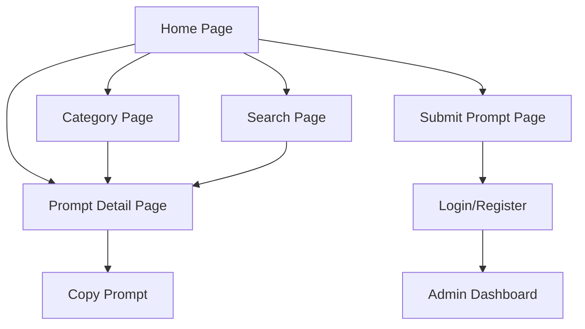

## 1. Product Overview
Diretório de prompts otimizados para desenvolvimento com Trae. Permite que desenvolvedores encontrem, copiem e utilizem prompts específicos para criar aplicações com o editor Trae.

Plataforma gratuita que centraliza prompts testados e categorizados, aumentando a produtividade no desenvolvimento com IA.

## 2. Core Features

### 2.1 User Roles
| Role | Registration Method | Core Permissions |
|------|---------------------|------------------|
| Visitor | No registration required | Browse, search and copy prompts |
| Contributor | Email registration | Submit new prompts, rate existing ones |
| Admin | Manual assignment | Manage prompts, categories and users |

### 2.2 Feature Module
Nosso diretório de prompts consiste nas seguintes páginas principais:
1. **Home page**: hero section, navegação por categorias, prompts em destaque.
2. **Category page**: lista de prompts por categoria, filtros e busca.
3. **Prompt detail page**: conteúdo completo do prompt, botão copiar, exemplos de uso.
4. **Search page**: resultados de busca, sugestões relacionadas.
5. **Submit prompt page**: formulário para enviar novos prompts, validação de conteúdo.

### 2.3 Page Details
| Page Name | Module Name | Feature description |
|-----------|-------------|---------------------|
| Home page | Hero section | Apresentação do diretório com estatísticas e call-to-action principal. |
| Home page | Category navigation | Cards clicáveis com ícones para cada categoria de prompt. |
| Home page | Featured prompts | Grid com os prompts mais populados e recentes, com preview do conteúdo. |
| Category page | Category header | Título da categoria, descrição e contador de prompts disponíveis. |
| Category page | Prompt list | Lista paginada de prompts com título, descrição curta e tags. |
| Category page | Filters sidebar | Filtros por dificuldade, popularidade e data de criação. |
| Prompt detail page | Prompt content | Área principal com o texto completo do prompt, formatado e destacado. |
| Prompt detail page | Copy functionality | Botão "Copiar" com feedback visual de sucesso ao clicar. |
| Prompt detail page | Usage examples | Seção com exemplos práticos de como aplicar o prompt no Trae. |
| Prompt detail page | Related prompts | Sugestões de prompts similares baseados em tags e categoria. |
| Search page | Search bar | Campo de busca com sugestões automáticas enquanto digita. |
| Search page | Results display | Grid ou lista de resultados com destaque dos termos buscados. |
| Search page | No results state | Mensagem amigável com sugestões de categorias alternativas. |
| Submit prompt page | Submission form | Formulário com campos para título, descrição, categoria e conteúdo do prompt. |
| Submit prompt page | Validation | Validação em tempo real e feedback de erros para cada campo. |
| Submit prompt page | Success message | Confirmação de envio com tempo estimado de revisão. |

## 3. Core Process

### Visitor Flow
O visitante acessa a homepage e pode navegar por categorias ou usar a busca para encontrar prompts específicos. Ao clicar em um prompt, vê o conteúdo completo e pode copiar com um clique. O processo é otimizado para descoberta rápida e cópia imediata.

### Contributor Flow
O contribuidor segue o fluxo do visitante, mas pode também enviar novos prompts através do formulário de submissão. Após login, ganha acesso a recursos adicionais como favoritar prompts e ver histórico de contribuições.

### Admin Flow
O admin revisa submissions pendentes, aprova ou rejeita novos prompts, e gerencia categorias e conteúdo existente através de um painel de controle dedicado.

## 4. User Interface Design

### 4.1 Design Style
- **Cores primárias**: Azul tecnológico (#0066FF) e branco
- **Cores secundárias**: Cinza claro (#F5F5F5) e cinza escuro (#333333)
- **Estilo de botões**: Arredondados com hover effects suaves
- **Fonte principal**: Inter, tamanhos variando de 14px a 32px
- **Layout**: Card-based com grid responsivo
- **Ícones**: Estilo line-icons minimalistas

### 4.2 Page Design Overview
| Page Name | Module Name | UI Elements |
|-----------|-------------|-------------|
| Home page | Hero section | Background gradient suave, título grande em negrito, subtítulo menor, CTA button primário destacado. |
| Home page | Category cards | Cards com ícones coloridos, bordas arredondadas, sombra suave, hover effect com scale. |
| Home page | Prompt grid | Cards de 3 colunas no desktop, 1 coluna no mobile, com preview de texto truncado e botão copiar. |
| Prompt detail page | Content area | Background branco, texto em fonte monoespaçada para prompts de código, syntax highlighting. |
| Prompt detail page | Copy button | Botão flutuante no canto superior direito, muda para "Copiado!" com checkmark após clicar. |
| Search page | Search bar | Input grande centralizado, ícone de busca à esquerda, sugestões dropdown ao digitar. |

### 4.3 Responsiveness
Desktop-first com breakpoints para tablet (768px) e mobile (480px). Touch interaction otimizado com botões maiores e espaçamento adequado para dispositivos móveis.